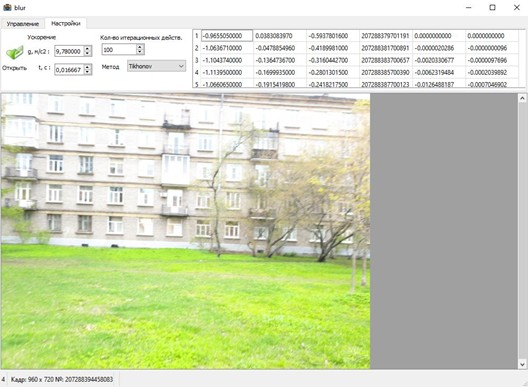
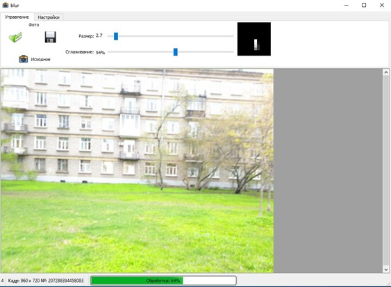
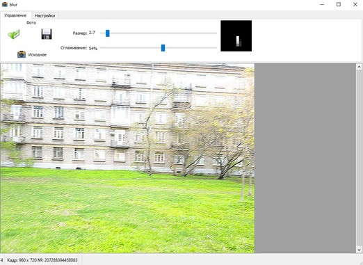

# Image Deblur IMU Qt

Desktop C++/Qt application for restoring motion-blurred images using inertial sensor data from a smartphone.

The application loads a blurred image and accelerometer readings, estimates camera displacement, builds a PSF (point spread function), and applies deconvolution methods to improve image sharpness.

## Project summary

This project was developed as a graduation thesis project on image restoration with unknown point spread function parameters. The main idea is to use inertial sensor readings recorded during shooting to estimate camera motion and then restore the image using deconvolution algorithms.

## Features

- Load blurred images in common formats: JPEG, PNG, BMP.
- Load accelerometer readings from a CSV file.
- Calculate camera displacement from inertial sensor data.
- Build a PSF kernel from calculated displacement coordinates.
- Preview restoration using faster deconvolution methods.
- Restore images using the Richardson-Lucy iterative algorithm.
- Compare the original image and the restored result.
- Configure key parameters: shutter speed, gravity value, PSF scale, smoothing, and iteration count.
- Qt-based graphical interface.

## Implemented / used methods

- PSF construction from accelerometer data.
- Tikhonov regularization for fast preview.
- Wiener filter for fast preview.
- Richardson-Lucy deconvolution as the main restoration method.
- FFT-based processing using FFTW.

## Technologies

- C++
- Qt / Qt Creator
- Qt Widgets
- CMake / qmake
- FFTW
- Windows 11

The project was originally developed with Qt Creator 4.11.1 on Windows 11.

## Repository structure

```text
.
├── CMakeModules/              # CMake helper modules
├── FFTW/                      # FFTW library files / dependency files
├── Icons/                     # Application icons and UI resources
├── Models/                    # Project models / additional resources
├── CheckUpdatesThread.cpp     # Update checking thread implementation
├── CheckUpdatesThread.h
├── DeconvolutionTool.cpp      # Image restoration and deconvolution logic
├── DeconvolutionTool.h
├── HelpDialog.cpp             # Help dialog implementation
├── HelpDialog.h
├── HelpDialog.ui
├── ImageUtils.cpp             # Image processing utility functions
├── ImageUtils.h
├── MainWindow.cpp             # Main application window logic
├── MainWindow.h
├── MainWindow.ui
├── MathUtils.cpp              # Mathematical helper functions
├── MathUtils.h
├── WorkerThread.cpp           # Background image processing thread
├── WorkerThread.h
├── MainResources.qrc          # Qt resource collection
├── main.cpp                   # Application entry point
├── blur.pro                   # Qt qmake project file
├── CMakeLists.txt             # CMake project configuration
├── docs/                      # Documentation
├── data/                      # Example input data
└── screenshots/               # Application screenshots
```

## Input data

The application expects two input files:

1. A blurred image in one of the supported formats: `JPEG`, `PNG`, `BMP`.
2. A CSV file with accelerometer readings recorded during shooting.

Expected CSV structure:

```csv
ax,ay,az,timestamp_ns
-1.7621863,5.559506,8.341654,126317664071857
-1.7621863,5.559506,8.341654,126317664048857
```

If the application expects a file without a header, remove the first line and keep only numeric rows.

## Build and run

The easiest way to run the project is through Qt Creator.

### Option 1: Qt Creator + qmake

1. Install Qt and Qt Creator.
2. Clone the repository.
3. Open `blur.pro` in Qt Creator.
4. Select a suitable Qt Kit.
5. Run qmake.
6. Build the project.
7. Run the application.

### Option 2: Qt Creator + CMake

1. Install Qt and Qt Creator.
2. Clone the repository.
3. Open `CMakeLists.txt` in Qt Creator.
4. Select a suitable Qt Kit.
5. Configure the project.
6. Build and run.

More detailed Windows instructions are available in [`docs/BUILD_WINDOWS.md`](docs/BUILD_WINDOWS.md).

## How to use

1. Run the application.
2. Load a blurred image.
3. Load a CSV file with accelerometer readings.
4. Set the shooting parameters:
   - shutter speed;
   - gravity value;
   - PSF scale;
   - smoothing level;
   - iteration count for Richardson-Lucy.
5. Choose a preview method: Tikhonov regularization or Wiener filter.
6. Start image restoration.
7. Compare the restored result with the original image.

## Screenshots

Add screenshots to the `screenshots/` folder after uploading the project:

```text
screenshots/main-window.png
screenshots/settings.png
screenshots/result.png
```

Then uncomment or update this section:

<!--



-->

## Limitations

- The current version focuses mainly on blur caused by camera movement parallel to the photographed object.
- Accuracy depends on the quality and frequency of inertial sensor readings.
- Strong noise and complex camera motion may reduce restoration quality.
- Gyroscope-based restoration for rotational blur can be added as a future improvement.

## Future improvements

- Add processing of gyroscope data.
- Add automatic PSF scale estimation.
- Add more objective image quality metrics.
- Add batch processing for multiple images.
- Add Linux/macOS build instructions.
- Add unit tests for mathematical and image-processing modules.

## Author

Daniil Danchishen

## License

This project is licensed under the MIT License. See [`LICENSE`](LICENSE) for details.
